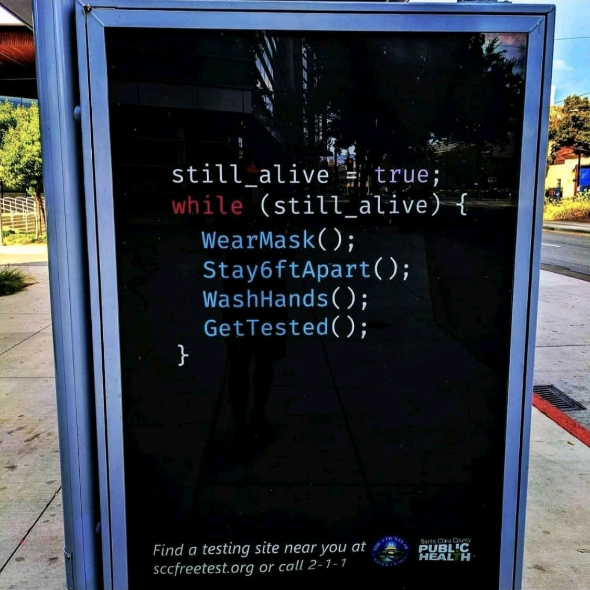
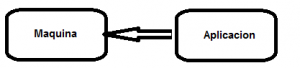
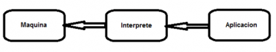
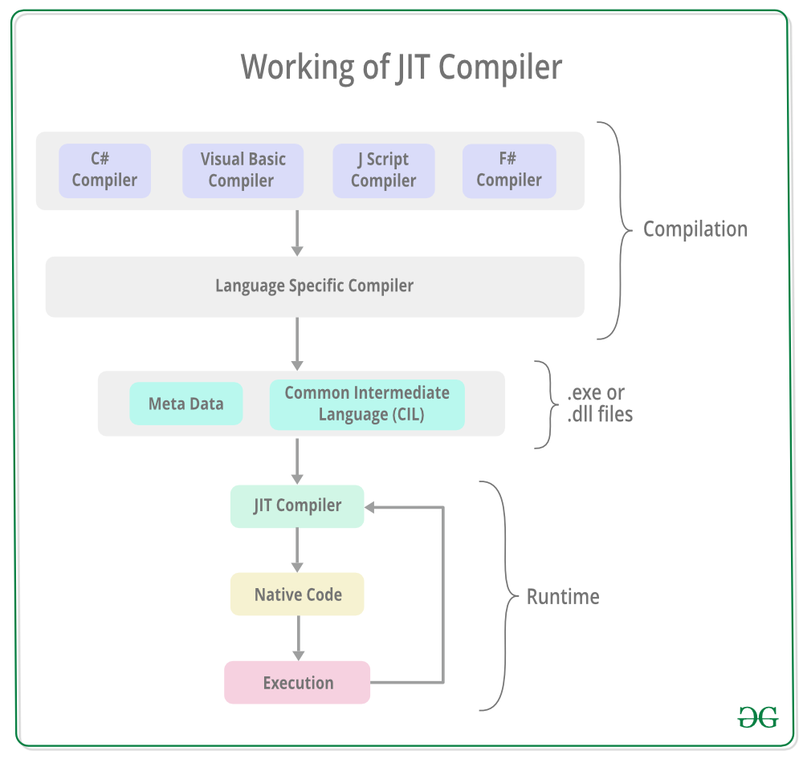

//include::_settings_reveal.adoc[]

include::_settings_deck.adoc[]

= React4teachers: 2022 edition

== React4teachers

*From Zero 2 Hero*

image::images/react-zero-hero.jpeg[800,600]

Conselleria d'educacio de les Illes Balears

By Alberto Soto

UD1-Ecma6

2022

== Contenido del curso

* 1.- Introducción
* 2.- De VanillaJs a React 
* 3.- React framework: Motivos de exito
* 4.- React framework: Class components vs Function components 
* 5.- React framework: State management - Control de el estado de la aplication 
* 6.- React framework: Routing 
* 7.- Storybook 
* 8.- Monorepo 
* 9.- TailwindCSS y StyledComponents 
* 10.-Despliegue de aplicaciones

== Programming?

== Introduccion a react

La mejor introduccion que podemos ofrecer para ReactJs es el propio javascript: Conocer nuestro punto de partida real es basico para saber que capacidades comporta.

Tradicionalmente al uso de javascript plano, sin intermediacion de librerias lo denominaremos VanillaJS.

React es una framework/libreria JS que extiende la funcionalidad de vanillaJS al infinito.

== Lenguaje compilado

- PROS: Velocidad. IoT *. Especifidad
 
- CONS: Depende arq. Patrones obsoletos en control de datos.

- Ejemplos: C, C ++, Visual Basic, Fortran, Pascal

== Lenguajes interpretados

- PROS: Facil instalacion, abstraccion.
 
- CONS: Lentitud, Consumo memoria

- Examples: Php, js, python

== Semi-compiled languages

== Pregunta:

Que tipo de lenguaje es Javascript? compilado, interpretado o semi compilado?

== Pregunta II

Y RUST?

Repasemos la web!

== La web tradicional

- Tradicionalmente el servidor ha generado la salida del html que el navegador procesa.
- Aproximaciones basicas y manuales a ECMA5 para JS garantizaban compatibilidad

== Traditional JS Structure

Client side

[source,]
----
<!DOCTYPE html>
<html>
<body>

<h1>A Web Page</h1>

A Paragraph

<button type="button" onclick="myFunction()">Try it</button>

</body>
</html>
----

== Web 2.0

- El auge de la computacion + UX ha favorecido el desarrollo del entorno cliente
- Se genero el concepto de social web / web 2.0

== React Class

[source,]
----
import React from "react";
import { connect } from "react-redux";

const mapStateToProps = state => {
    return { articles: state.articles };
}
const ConnectedList = ({ articles }) => (
    <ul>
        { articles.map(article => (
            <li className="item" key={article.id}>{ article.title }</li>
        )) }
    </ul>
);
const List = connect(mapStateToProps)(ConnectedList);
class FirstComponent extends React.Component {
    render() {
        return (
            

                
Hello ankit this i

                <List></List>
            

        );
    }
}
export default FirstComponent;
----

== React hooks

[source,]
----
import React, { useState } from "react";
import ReactDOM from "react-dom";
import "./styles.css";
function App() {
  const [count, setCount] = useState(0);
  return (
    

      <h1>Hello CodeSandbox</h1>
      <h2>You clicked {count} times!</h2>

      <button onClick={() => setCount(count - 1)}>Decrement</button>
      <button onClick={() => setCount(count + 1)}>Increment</button>
    

  );
}
const rootElement = document.getElementById("root");
ReactDOM.render(<App />, rootElement);
----

https://codesandbox.io/s/7y6o4282lq?from-embed=&file=/src/index.js:0-521[source]

== Web 3.0

- El antiguo concepto de web semantica se ha transformado a una web en auge a traves de smart-contracts y totalmente descentralizada.

Responsables:

- Ts, js, block-chain
- potencia de cliente
- Headless, Serverless, SSR, SPA, SSG

== React + TS + solidity 

[source,]
----
import type { NextPage } from "next";
import Head from "next/head";

import styles from "../styles/Home.module.css";
import {
  Navbar,
  Footer,
  Loader,
  Services,
  Transactions,
  Welcome,
} from "../components";

const Home: NextPage = () => {
  return (
    

      <Head>
        <title>Web 3.0 Blockchain Solidity Example</title>
        <meta name="description" content="Web blockchain solidity example" />
        <link rel="icon" href="/favicon.ico" />
      </Head>
      <main className="gradient-bg-welcome">
        <Navbar />
        <Welcome />
      </main>
      <Services />
      <Transactions />
      <Footer />
    

  );
};

export default Home;
----

https://github.com/dunapanta/Web-3.0-Blockchain-Solidity-App[source]

== Conceptos tecnologicos

SSR: Server Side Rendering
SSG: Static Site Generation
SPA: Single Page Application

== SPA

Las SPA están estructuradas como una sola página HTML que no tiene contenido precargado. El contenido se carga a través de archivos Javascript para toda la aplicación y todo es una sola página HTML.

PROs: UX, control
Cons: SEO, deeplinking, payload

Actualmente: Backends/Social

React, AngularJS, Vue.js, Ember.JS y Svelte

== SSG Static Site Generation

La pagina se crea en tiempo de compilacion de manera integra o progresiva.

Metodologia: Gatsby, Nextjs
Proveedores: CDN, Netlify, Vercel

PRO: No hay nada mas rapido, SEO, escalable, economico.
Cons: No encaja en todo modelo de negocio. Personalizacion, contenido dinamico

== SSR

Actualmente se habla de SSR tradicional o SSR 2.0
Se puede hacer un renderizaje intermedio.

- Backend/microservicio
- Frontend Nextjs/SSR + Cache
- NextJS > SSG

Metodologia: Nextjs
Proveedores: Cloud provider, Netlify, Vercel

== Pregunto otra vez!

Entonces...
js es compilado o interpretado?

== 

== Bundlelers

- Webpack
- Vite
- 
