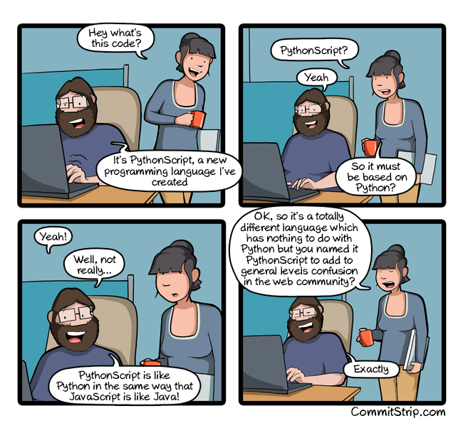
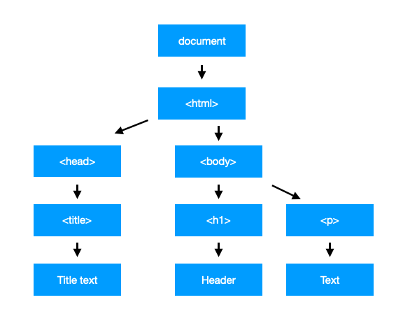
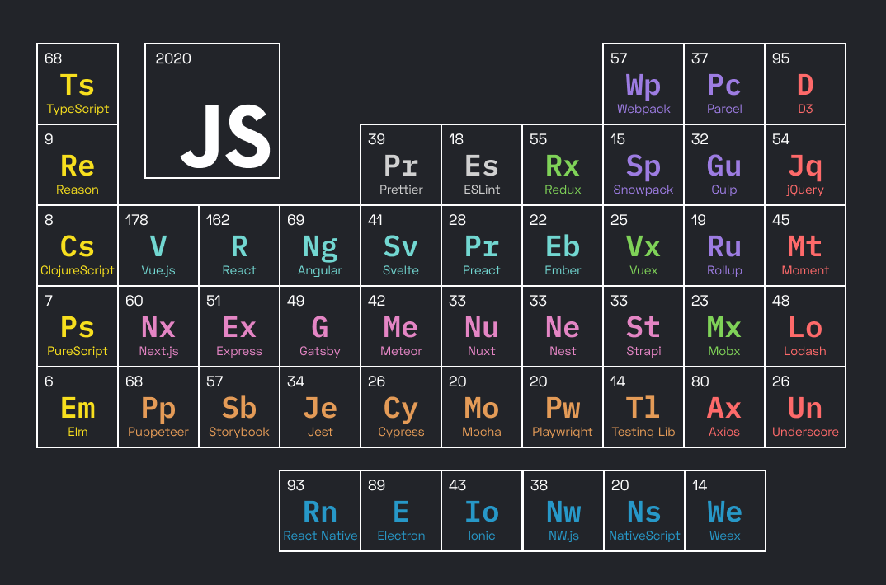
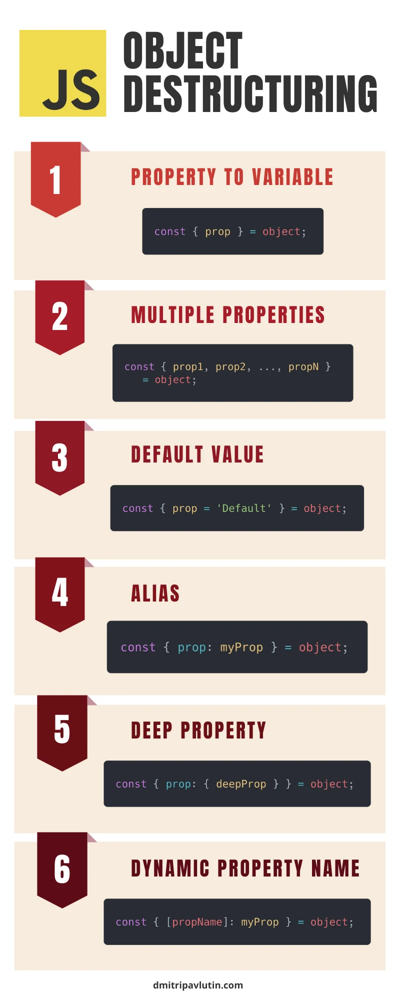

//include::_settings_reveal.adoc[]

include::_settings_deck.adoc[]

= React4teachers: 2022 edition

== React4teachers

*From Zero 2 Hero*

image::images/react-zero-hero.jpeg[800,600]

Conselleria d'educacio de les Illes Balears

By Alberto Soto

UD1-Ecma6

2022

== Contenido del curso

* 1.- Introducción
* 2.- De VanillaJs a React 
* 3.- React framework: Motivos de exito
* 4.- React framework: Class components vs Function components 
* 5.- React framework: State management - Control de el estado de la aplication 
* 6.- React framework: Routing 
* 7.- Storybook 
* 8.- Monorepo 
* 9.- TailwindCSS y StyledComponents 
* 10.-Despliegue de aplicaciones

== Programming?

image::images/programacion-cover.jpg[]

== Introduccion a react

La mejor introduccion que podemos ofrecer para ReactJs es el propio javascript: Conocer nuestro punto de partida real es basico para saber que capacidades comporta.

Tradicionalmente al uso de javascript plano, sin intermediacion de librerias lo denominaremos VanillaJS.

React es una framework/libreria JS que extiende la funcionalidad de vanillaJS al infinito.

== Lenguaje compilado

image::images/lenguajeCompilados.png[]

- PROS: Velocidad. IoT *. Especifidad
 
- CONS: Depende arq. Patrones obsoletos en control de datos.

- Ejemplos: C, C ++, Visual Basic, Fortran, Pascal

== Lenguajes interpretados

image::images/lenguajeInterpretados.png[]

- PROS: Facil instalacion, abstraccion.
 
- CONS: Lentitud, Consumo memoria

- Examples: Php, js, python

== Semi-compiled languages

image::images/lenguajeSemicompilado.png[]

== Pregunta:

Que tipo de lenguaje es Javascript? compilado, interpretado o semi compilado?

== Pregunta II

Y RUST?
Y WS?

Repasemos la web!

== WS?

No, no son web services

WebAssembly es empaquetado en nativo
Como la JVM, pero para cualquier lenguaje!
JS tb puede ser WebAssembly

https://engineering.q42.nl/webassembly/[Ejemplo de js a WebAssembly]

== La web tradicional

- Tradicionalmente el servidor ha generado la salida del html que el navegador procesa.
- Aproximaciones basicas y manuales a ECMA5 para JS garantizaban compatibilidad

== Traditional JS Structure

Client side

[source,]
----
<!DOCTYPE html>
<html>
<body>

<h1>A Web Page</h1>

A Paragraph

<button type="button" onclick="myFunction()">Try it</button>

</body>
</html>
----

== Web 2.0

- El auge de la computacion + UX ha favorecido el desarrollo del entorno cliente
- Se genero el concepto de social web / web 2.0

== React Class

[source,]
----
import React from "react";
import { connect } from "react-redux";

const mapStateToProps = state => {
    return { articles: state.articles };
}
const ConnectedList = ({ articles }) => (
    <ul>
        { articles.map(article => (
            <li className="item" key={article.id}>{ article.title }</li>
        )) }
    </ul>
);
const List = connect(mapStateToProps)(ConnectedList);
class FirstComponent extends React.Component {
    render() {
        return (
            

                
Hello ankit this i

                <List></List>
            

        );
    }
}
export default FirstComponent;
----

== React hooks

[source,]
----
import React, { useState } from "react";
import ReactDOM from "react-dom";
import "./styles.css";
function App() {
  const [count, setCount] = useState(0);
  return (
    

      <h1>Hello CodeSandbox</h1>
      <h2>You clicked {count} times!</h2>

      <button onClick={() => setCount(count - 1)}>Decrement</button>
      <button onClick={() => setCount(count + 1)}>Increment</button>
    

  );
}
const rootElement = document.getElementById("root");
ReactDOM.render(<App />, rootElement);
----

https://codesandbox.io/s/7y6o4282lq?from-embed=&file=/src/index.js:0-521[source]

== Web 3.0

- El antiguo concepto de web semantica se ha transformado a una web en auge a traves de smart-contracts y totalmente descentralizada.

Responsables:

- Ts, js, block-chain
- potencia de cliente
- Headless, Serverless, SSR, SPA, SSG

== React + TS + solidity 

[source,]
----
import type { NextPage } from "next";
import Head from "next/head";

import styles from "../styles/Home.module.css";
import {
  Navbar,
  Footer,
  Loader,
  Services,
  Transactions,
  Welcome,
} from "../components";

const Home: NextPage = () => {
  return (
    

      <Head>
        <title>Web 3.0 Blockchain Solidity Example</title>
        <meta name="description" content="Web blockchain solidity example" />
        <link rel="icon" href="/favicon.ico" />
      </Head>
      <main className="gradient-bg-welcome">
        <Navbar />
        <Welcome />
      </main>
      <Services />
      <Transactions />
      <Footer />
    

  );
};

export default Home;
----

https://github.com/dunapanta/Web-3.0-Blockchain-Solidity-App[source]

== Conceptos tecnologicos

* SSR: Server Side Rendering
* SSG: Static Site Generation
* SPA: Single Page Application

== SPA

Las SPA están estructuradas como una sola página HTML que no tiene contenido precargado. El contenido se carga a través de archivos Javascript para toda la aplicación y todo es una sola página HTML.

* PROs: UX, control
* Cons: SEO, deeplinking, payload

Actualmente: Backends/Social

React, AngularJS, Vue.js, Ember.JS y Svelte

== SSG Static Site Generation

La pagina se crea en tiempo de compilacion de manera integra o progresiva.

* Metodologia: Gatsby, Nextjs
* Proveedores: CDN, Netlify, Vercel

* PRO: No hay nada mas rapido, SEO, escalable, economico.
* Cons: No encaja en todo modelo de negocio. Personalizacion, contenido dinamico

== SSR

Actualmente se habla de SSR tradicional o SSR 2.0
Se puede hacer un renderizaje intermedio.

- Backend/microservicio
- Frontend Nextjs/SSR + Cache
- NextJS > SSG

Metodologia: Nextjs
Proveedores: Cloud provider, Netlify, Vercel

== Pregunto otra vez :)

Entonces...
js es compilado o interpretado?

== Java-script?

https://www.jetbrains.com/lp/devecosystem-2020/javascript/[Developers survey]

 

== La confusion: ECMA

Que es ECMA? Un subset de javascript.

ECMA 5 creado en 2009, acogido por completo en 2016.

Incluye:

* High-order iteration functions (map, reduce, filter, forEach);
* JSON support;
* Getters and setters;
* Better reflection and object properties;

== La solucion: ECMA 6

ECMA 6 supuso un gran cambio en la percepcion de la web. Liberado en 2015.
Incluye:

* Promises.
* Modules;
* Classes;
* Block-scoped variable declarations (let);
* Arrow functions;
* Template literal;
* Spread operator;
* De-structuring assignment;
* Parameter default values;
* Rest parameters;
* Symbols;
* Generator functions.

== La reproduccion: ECMA 5.1

Es el estandard al que se han acogido los navegadores.

Jquery esta muerto!
https://youmightnotneedjquery.com[Ejemplo]

Motivos: 

* Vanilla permite hacer TODO lo que permite jquery, pero no lo sabiamos.
* Nos ha condicionado la escritura del lenguaje
* Ha permitido el sobreuso de plugins y una web pesada por sobre abuso de ellos.

Soluciones de vanilla: template literals, fetch, querys

== DOM, Shadow DOM, Virtual DOM

- Domain Object Model

La manipulación del DOM no es tan fácil y cómoda, y 
tiene muchos problemas de rendimiento. Hoy en día, hay dos conceptos esenciales de DOM: Shadow DOM y Virtual DOM

https://software.hixie.ch/utilities/js/live-dom-viewer/[Live DOM]

== DOM, Shadow DOM, Virtual DOM

- Shadow DOM

Es un arbol que reemplazara el DOM a posteriori, como si se tratara de un buffer.
Es una copia en local de parte del arbol DOM original.

- Virtual DOM

Es una implementacion en memoria que integra React. Vue lo ha empeyado a usar tambien "recientemente".
La copia es completa

Ambos solucionan problemas de rendimiento 

== El ecosistema actual

== El ecosistema actual

- Package managers
- Bundlers
- Transpilers
- Precompilers

== Gestores de paquetes

Dado que nodejs incluye npm, el gestor de paquetes mas habitual es npm.

Sin embargo, yarn, es una alternativa que permite:

- Mayor velocidad al tener una cache intermedia
- Permite el trabajo con monorepo (workspaces)

Por otro lado, tenemos los generadores de arquetipos, como Yeoman

== Module Bundlers

- Webpack
- Vite
- Parcel
- Rollup

Los antiguos gestores de tarea como GULP o GRUNT han tenido que rendirse y desaparecer para permitir a evolucion de los bundlers, que son gestores de modulos. Los modulos se centran en tareas por funcionalidad.

Vite esta ganando adeptos, simplificando la configuracion de Rollup. Sin embargo, para grandes proyectos webpack es un estandard por su robustez.

== Transpilers

El mismo codigo js debe ser convertido a una version de ECMA estandard que sea valido en todo navegador.

El transpiler por excelencia es Babel.

La intencion de Babel es modificar nuestro codigo para garantizar su compatibilidad > ECMA5

== Practice time!

== Vanilla JS topics

- The death of var
- Null is not null
- Falsy values
- The 3 ways of a function
- Everything is an object
- JS Classes from ECMA6
- Object destructuring
- Iterate me!
- Template literals
- From Jquery to vanillaJS

== The death of var

[source,]
----
let length = 16; // Number
const lastName = "Johnson"; // String
let cars = ["Saab", "Volvo", "BMW"]; // Array
let x = {firstName:"John", lastName:"Doe"}; // Object
console.log(typeof lastName);
----

== Null is not null

[source,]
----
typeof undefined // undefined
typeof null // object
null === undefined // false
null == undefined // true
----

== Falsy values

- false
- undefined
- null
- 0
- NaN
- the empty string ("")

[source,]
----
let b = new Boolean(false);
if (b)         // this condition evaluates to true
if (b == true) // this condition evaluates to false
----

== The 3 ways of a function

[source,]
----
function doLog(msg){
  console.log(msg);
}
let doAnotherLog = function(coolMsg){
  console.log(coolMsg);
}
const test = () => {
  console.log('hello world')
}
doLog('conventional function')
doAnotherLog('not so conventional function')
test()
----

== Everything is an object

[source,]
----
//Function type 2 (json object) (by expression)
let myFunctions = {
  /**
   * typical hello world
   * @param name parameter
   */
  sayHi: function (name) {
    console.log(`Aloha ${name}!`);
  }
};
myFunctions.sayHi("pepito");//<- execution
----

== JS Classes from ECMA6

[source,]
----
## ./modules/printer.js
export class Printer {
  constructor() {
    console.log('created a printer');
  }

  message(msg) {
    console.log(msg);
  }
}

## main.js
import { Printer } from './modules/printer';

const printerObj = new Printer();
printerObj.message('hello world');

----

== Object destructuring

== Object destructuring

[source,]
----
const hero = {
  name: 'Batman',
  realName: 'Bruce Wayne'
};
const { name, realName } = hero;
name;     // => 'Batman',
realName; // => 'Bruce Wayne'
let a, b, rest;
[a, b] = [10, 20];

console.log(a);
// expected output: 10

console.log(b);
// expected output: 20

[a, b, ...rest] = [10, 20, 30, 40, 50];

console.log(rest);
// expected output: Array [30,40,50]
----

== Template literals

[source,]
----
let person = 'Mike';
let age = 28;

function myTag(strings, personExp, ageExp) {
  let str0 = strings[0]; // "That "
  let str1 = strings[1]; // " is a "
  let str2 = strings[2]; // "."

  let ageStr;
  if (ageExp > 99){
    ageStr = 'centenarian';
  } else {
    ageStr = 'youngster';
  }

  // We can even return a string built using a template literal
  return `${str0}${personExp}${str1}${ageStr}${str2}`;
}

let output = myTag`That ${ person } is a ${ age }.`;

console.log(output);
// That Mike is a youngster.
----

== Iterate me

[source,]
----

// Creating a map using Map object
let mp=new Map()
 
// Adding values to the map
mp.set("a",1);
mp.set("b",2);
mp.set("c",3);
 
// Logging map object to console
mp.forEach((values,keys)=>{
  document.write(values,keys+" ")
})
var el = document.getElementById('root');
var arr = [2, 5, 6, 3, 8, 9];
var newArr = arr.map(function(val, index){
    return {key:index, value:val*val};
})
console.log(newArr)
el.innerHTML = JSON.stringify(newArr);
----

https://www.geeksforgeeks.org/most-useful-javascript-array-functions-part-2/[More info]

== From Jquery to vanillaJS

Select elements:

[source,]
----
// jQuery, select all instances of .box
$(".box");
// Instead, select the first instance of .box
document.querySelector(".box");
// …or select all instances of .box  
document.querySelectorAll(".box");
----

Function on elements:

[source,]
----
// with jQuery
// Hide all instances of .box
$(".box").hide();
// Without jQuery
// Iterate over the nodelist of elements to hide all instances of .box
document.querySelectorAll(".box").forEach(box => { box.style.display = "none" })
----

== From Jquery to vanillaJS

Inner child
[source,]
----
// With jQuery
// Select the first instance of .box within .container
var container = $(".container");
// Later...
container.find(".box");

// Without jQuery
// Select the first instance of .box within .container
var container = document.querySelector(".container");
// Later...
container.querySelector(".box");
----

Traversing

[source,]
----
// with jQuery
// Return the next, previous, and parent element of .box
$(".box").next();
$(".box").prev();
$(".box").parent();

// Without jQuery
// Return the next, previous, and parent element of .box
var box = document.querySelector(".box");
box.nextElementSibling;
box.previousElementSibling;
box.parentElement;
----

== From Jquery to vanillaJS

Events

[source,]
----
// With jQuery
$(".button").click(function(e) { /* handle click event */ });
$(".button").mouseenter(function(e) {  /* handle click event */ });
$(document).keyup(function(e) {  /* handle key up event */  });

// Without jQuery
document.querySelector(".button").addEventListener("click", (e) => { /* ... */ });
document.querySelector(".button").addEventListener("mouseenter", (e) => { /* ... */ });
document.addEventListener("keyup", (e) => { /* ... */ });
----

Trigger events

[source,]
----
// With jQuery
// Trigger myEvent on document and .box
$(document).trigger("myEvent");
$(".box").trigger("myEvent");

// Without jQuery
// Create and dispatch myEvent
document.dispatchEvent(new Event("myEvent"));
document.querySelector(".box").dispatchEvent(new Event("myEvent"));
----

== From Jquery to vanillaJS

On ready
[source,]
----
// With jQuery
$(document).ready(function() { 
  /* Do things after DOM has fully loaded */
});

// Without jQuery
// Define a convenience method and use it
var ready = (callback) => {
  if (document.readyState != "loading") callback();
  else document.addEventListener("DOMContentLoaded", callback);
}

ready(() => { 
  /* Do things after DOM has fully loaded */ 
});
----

Fetch

[source,]
----
// With jQuery
$.ajax({
    url: "data.json"
  }).done(function(data) {
    // ...
  }).fail(function() {
    // Handle error
  });

// Without jQuery
fetch("data.json")
  .then(data => {
    // Handle data
  }).catch(error => {
    // Handle error
  });
----

https://tobiasahlin.com/blog/move-from-jquery-to-vanilla-javascript/[Source]

== Formato del curso

[source,]
----
let isPresentacion = true;
const presentationContent=[{time:15,type:'presentacionPersonal'},{time:15,type:'presentacionCurso'}]
const regularContent=[{time:30,type:'standup'}]
const inicio = isPresentacion?presentationContent:regularContent;
let doMasterClass = (doRecording) => {return 'knowledge'}
const principal = () => { doMasterClass(true); return {time:60,type:'learnNewTopics'}}
const prepareNextLesson = {time:30,type:'flushKnowledge'}
let result = [...inicio,principal(),prepareNextLesson]
const NUM_LESSONS = 5
const HOUR_VALUE = 60
let totalLessonTime = 0
result.forEach(aux=>{ totalLessonTime+= aux.time;})
console.log(`Total time per lesson is ${totalLessonTime} minutes`)
console.log(`Total in-person time is ${totalLessonTime*NUM_LESSONS} minutes (${(totalLessonTime*NUM_LESSONS)/HOUR_VALUE}h)`)
----
