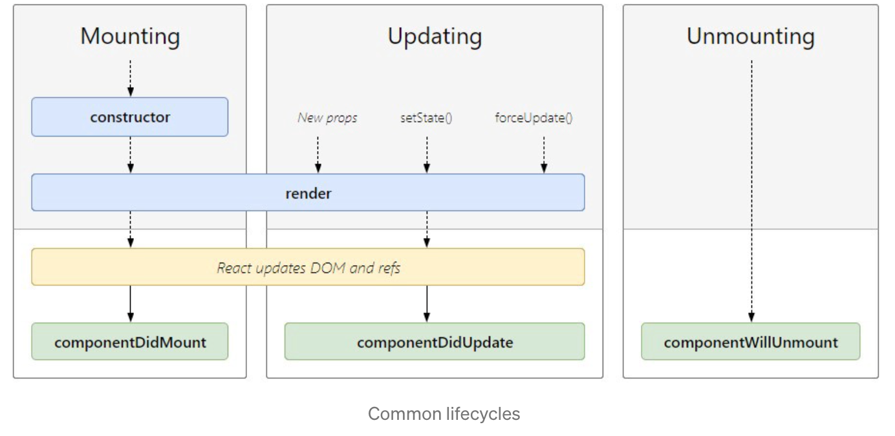
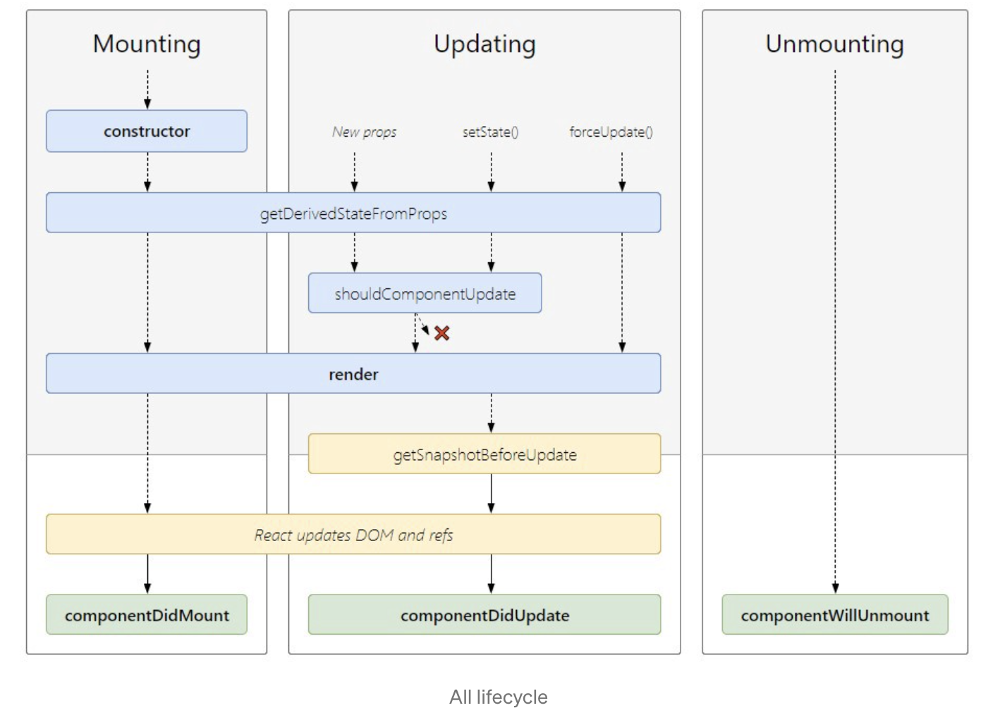
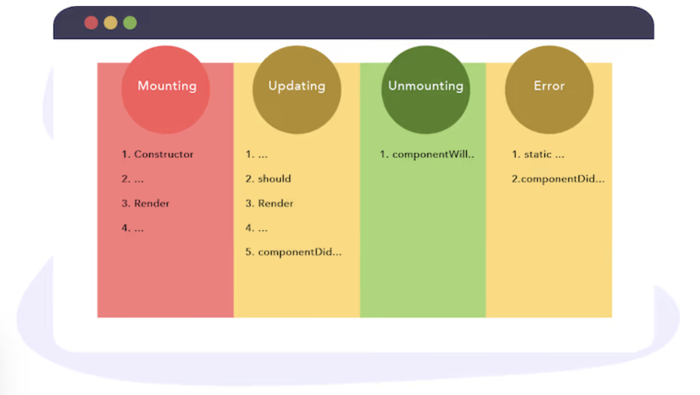

//include::_settings_reveal.adoc[]

include::_settings_deck.adoc[]

= React4teachers: 2022 edition

== React4teachers: From Zero 2 Hero

image::images/react-zero-hero.jpeg[800,600]

== Contenido del curso

* 1.- Introducció 
* 2.- De VanillaJs a React 
* 3.- React framework: Motivos de exito
* 4.- React framework: Class components vs Function components 
* 5.- React framework: State management - Control de el estado de la aplication 
* 6.- React framework: Routing 
* 7.- Storybook 
* 8.- Monorepo 
* 9.- TailwindCSS y StyledComponents 
* 10.-Despliegue de aplicaciones

== Chapter 3

3.- React framework: Motivos de exito

== Casos de exito

React fue creado por los desarrolladores de Facebook e Instagram para crear componentes interactivos dentro de una interfaz de usuario. La librería React se hizo de código abierto en 2013 y se ha hecho muy popular desde entonces. Mientras Facebook e Instagram siguen utilizando React, otros productos conocidos, como Netflix, también han empezado a implementarlo en su interfaz de usuario. 
 
Otras aplicaciones conocidas:

* Yahoo Mail
* Vivaldi Web Browser
* Khan Academy
* AirBnB
* Discord
* WhatsApp (web)

== Aspectos tecnicos

- Permite la generacion de componentes independientes
- Permite la comunicacion entre dichos componentes
- Se basa en estructuras nativas del lenguaje, sin curva de aprendizaje elevada (pasaras mas tiempo aprendiendo vanillaJS que React)
- Es sencillo y permite resultado rapido
- Permite su escalabilidad
- Es la base de otras plataformas de alto rendimiento como Next.js o Gatsby

== Elementos basicos de ECMA 6

- Clases
- Arrow functions
- Variables
- Recorrido de colecciones
- Destructuring
- Spread Operator
- Modulos
- Operador ternario

https://www.w3schools.com/react/react_es6.asp[Fuente]

== Clases

Las primeras versiones de React se basan en clases. Las clases tienen un comportamiento complejo arquitectonicamente hablando y una serie de fases en su ciclo de vida. Sin embargo, se basan en ECMA6.

[source,]
----
class Car {
  constructor(name) {
    this.brand = name;
  }
  present() {
    return 'I have a ' + this.brand;
  }
}
class Model extends Car {
  constructor(name, mod) {
    super(name);
    this.model = mod;
  }  
  show() {
      return this.present() + ', it is a ' + this.model
  }
}
const mycar = new Model("Ford", "Mustang");
mycar.show();
----

== Arrow functions

Las arrow functions han tenido un gran auge con la inclusion de los denominados react Hooks. React Hooks son funcionalidades que puedes incorporar a tu aplicacion en calidad de HoC (high order component), o las antiguas primitivas. Esto ha facilitado y simplificado la sintaxis, aunque para entornos complejos puede que sigas usando clases.

[source,]
----
hello = () => {
  return "Hello World!";
}
----

== Variables

Esta prohibido usar "var".

* Su scope es global y puede hacer que pierdas el control del flujo de la aplicacion. 

* let y const tienen unas casuisticas muy determinadas que cumplen con todos los requerimientos que vayas a necesitar.

* Si necesitas pasar informacion de parent>child utiliza estados

== Recorrido de colecciones

Vas a utilizar map y forEach, mucho, mucho, mucho

- En el caso de map, deberas devolver algo
- En el caso de forEach, no

Si utilizas un render iterando una coleccion, deberas indicar una *key*

[source,]
----
const myArray = ['apple', 'banana', 'orange'];
const myList = myArray.map((item) => 
{item}
)
----

== Destructuring

La desestructuracion ha sido muy expandida desde que se empiezan a utilizar con react hooks. Sin embargo es una caracteristica nativa

[source,]
----
const vehicles = ['mustang', 'f-150', 'expedition'];
// old way
const car = vehicles[0];
const truck = vehicles[1];
const suv = vehicles[2];
// ahora
const [car, truck, suv] = vehicles;
----

Tambien sirve para obtener elementos de segundo orden en un json

== Spread Operator

La generacion de formas combinadas de colecciones o extender un elemento json anadiendo nuevos elementos es muy util y rapida, y aunque consume mas memoria, en utilizacion con let es muy rapida

[source,]
----
const numbersOne = [1, 2, 3];
const numbersTwo = [4, 5, 6];
const numbersCombined = [...numbersOne,...numbersTwo];
//junto a desestructuracion
const numbers = [1, 2, 3, 4, 5, 6];
const [one, two, ...rest] = numbers;
----

== Modulos

[source,]
----
//WITHOUT DEFAULT
const name = "Jesse"
const age = 40
export { name, age }

import { name, age } from "./person.js";
//WITH DEFAULT
const message = () => {
  const name = "Jesse";
  const age = 40;
  return name + ' is ' + age + 'years old.';
};
export default message;

import message from "./message.js";
----

== Operador ternario

Las bicondicionales permiten simplificar la sintaxis y en muchos casos lo utilizaremos

[source,]
----
authenticated ? renderApp() : renderLogin();
----

== React lifecycle

== React lifecycle

== React mount

Mounting significa poner elementos en el DOM. React utiliza el DOM virtual para poner todos los elementos en la memoria. Tiene cuatro métodos incorporados para montar un componente:

* constructor()
* static getDerivedStateFromProps()
* render()
* componentDidMount()

[source,]
----
import React, { Component } from 'react'

export default class App extends Component {
  constructor(props){
    super(props)
    this.state = {
      name: 'Constructor Method'
    }
  }
  render() {
    return (
      

       
 This is a {this.state.name}

      

    )
  }
}
----

== React mount: getDerivedStateFromProps

Llamado justo antes de renderizar el elemento en nuestro DOM. Toma props y state como argumento y devuelve un objeto con los cambios en el estado.

[source,]
----
mport React, { Component } from 'react'

export class ChildComponent extends Component {
    constructor(props){
        super(props)
        this.state = {
          name: 'Constructor Method'
        }
      }

    static getDerivedStateFromProps(props, state) {
        return {name: props.nameFromParent} 
      }
    render() {
        return (
            

                This is a {this.state.name}
            

        )
    }
}
----

== React mount: render

Este es el único método obligatorio requerido por React. Este método es el responsable de convertir nuestro JSX en DOM

[source,]
----
import React, { Component } from 'react'

export default class renderMethod extends Component {
    render() {
        return (
            <>
                 
This is a render method

            </>
        )
    }
}
----

== React mount: componentDidMount

El método del ciclo de vida más común y ampliamente utilizado es componentDidMount. Este método es llamado después de que el componente sea renderizado. También puede utilizar este método para llamar a datos externos desde la API.

[source,]
----
import React, { Component } from 'react'

export default class componentDidMountMethod extends Component {
  constructor(props){
    super(props)
    this.state = {
      name: 'This name will change in 5 sec'
    }
  }
  componentDidMount() {
    setTimeout(() => {
      this.setState({name: "This is a componentDidMount Method"})
    }, 5000)

  }
  render() {
    return (
      

       
{this.state.name}

      

    )
  }
}
----

== React mount: componentDidMount + fetch

[source,]
----
import React, { Component } from 'react'

export default class componentDidMountMethod extends Component {
  constructor(props){
    super(props)
    this.state = {
      data: []
    }
  }

  componentDidMount() {
    fetch('https://jsonplaceholder.typicode.com/users').then(
        (response) => response.json()
    ).then(data => this.setState({data: data}))

  }

  render() {
    return (
      

       
This will print all the name available in API users data

    {this.state.data.map(d=> <h6 key={d.id}>{d.name}</h6>)}
      

    )
  }
}
----

== React: Updating

Esta es la segunda fase del ciclo de vida de React. Un componente se actualiza cuando hay un cambio de estado y props React tiene básicamente cinco métodos incorporados que se llaman mientras se actualizan los componentes.

* getDerivedStateFromProps()
* shouldComponentUpdate()
* render()
* getSnapshotBeforeUpdate()
* componentDidUpdate()

Ya hemos mencionado render y getDerivedStateFromProps

== shouldComponentUpdate()

Este método del ciclo de vida se utiliza cuando se desea que el estado o los props se actualicen o no. Este método devuelve un valor booleano que especifica si la renderización debe hacerse o no. El valor por defecto es true.

[source,]
----
import React, { Component } from 'react'

export default class shouldComponentUpdateMethod extends Component {
  constructor(props){
    super(props)
    this.state = {
      name: 'shouldComponentUpdate Method'
    }
  }
  shouldComponentUpdate() {
    return false; //Change to true for state to update
  }

  componentDidMount(){
    setTimeout(() => {
      this.setState({name: "componentDidMount Method"})
    }, 5000)
  }
  render() {
    return (
      

       
This is a {this.state.name}

      

    )
  }
}
----

nombre debería cambiar de "shouldComponentUpdate Method" a "componentDidMount Method" después de 5 segundos, pero no cambia porque shouldComponentUpdate es false, si lo cambias a true el estado se actualizará.

== getSnapshotBeforeUpdate

Este método se llama justo antes de actualizar el DOM. Tiene acceso a las props y al estado antes de la actualización. Aquí puedes comprobar cuál era el valor de tus props o state antes de su actualización

> Usar este metodo te fuerza a utilizar componentDidUpdate() 

[source,]
----
import React, { Component } from 'react'

export default class getSnapshotBeforeUpdateMethod extends Component {
    constructor(props){
        super(props)
        this.state = {
          name: 'constructor Method'
        }
      }

      componentDidMount(){
        setTimeout(() => {
          this.setState({name: "componentDidMount Method"})
        }, 5000)
      }
      getSnapshotBeforeUpdate(prevProps, prevState) {
        document.getElementById('previous-state').innerHTML = "The previous state was " + prevState.name
      }
      componentDidUpdate() {
        document.getElementById('current-state').innerHTML = "The current state is " + this.state.name
      }
    render() {
        return (
            <>
               <h5>This is a {this.state.name}</h5>
                

                

            </>
        )
    }
}
----

== componentDidUpdate()

El método componentDidUpdate es llamado después de que el componente sea actualizado en el DOM. Este es el mejor lugar en la actualización del DOM en respuesta al cambio de props y estado.

[source,]
----
import React, { Component } from 'react'

export default class componentDidUpdateMethod extends Component {
    constructor(props){
        super(props)
        this.state = {
            name: 'from previous state'
        }
    }
    componentDidMount(){
        setTimeout(() => {
            this.setState({name: "to current state"})
          }, 5000)
    }
    componentDidUpdate(prevState){
        if(prevState.name !== this.state.name){
            document.getElementById('statechange').innerHTML = "Yes the state is changed"
        }
    }
    render() {
        return (
            

                State was changed {this.state.name}
                

            

        )
    }
}
----

Nota: También puedes llamar a setState dentro de componentDidUpdate pero debes envolverlo en una condición como en el ejemplo anterior o causará un bucle infinito.

== Unmounting

El último o el final del ciclo de vida de React. Se utiliza cuando un componente se elimina del DOM. React sólo tiene un método incorporado que se llama cuando un componente es desmontado:

* componentWillUnmount()

Si hay alguna acción de limpieza como la cancelación de llamadas a la API o la limpieza de caché, puedes realizarla en el método componentWillUnmount. No se puede utilizar setState dentro de este método, ya que el componente nunca se volverá a renderizar.

== componentWillUnmount()

[source,]
----
import React, { Component } from 'react'

export default class componentWillUnmount extends Component {
    constructor(props){
        super(props)
            this.state = {
                show: true,
            } 
    }
    render() {
        return (
            <>
              
{this.state.show ? <Child/> : null}

               <button onClick={() => {this.setState({show: !this.state.show})}}>Click me to toggle</button>
            </>
        )
    }
}

export class Child extends Component{
    componentWillUnmount(){
        alert('This will unmount')
    }
    render(){
        return(
            <>
            I am a child component
            </>
        )
    }
}
----

== Resumen del ciclo de vida

* El método constructor() es el mejor lugar para inicializar nuestro estado
* El método getDerivedStateFromProps() es un método del ciclo de vida poco utilizado y es el mejor lugar para establecer el objeto de estado basado en los props iniciales.
* El método shouldComponentUpdate() especifica si React debe continuar con el renderizado o no.
El método render() es el método del ciclo de vida más utilizado y obligatorio.
* El método getSnapshotBeforeUpdate() tiene acceso a los props y al estado incluso después de la actualización.
* El método componentDidMount() es el método del ciclo de vida más común y utilizado y se llama después de que el componente se haya renderizado. También se puede utilizar este método para llamar a datos externos desde la API.
* El método componentDidUpdate() es llamado después de que el componente sea actualizado en el DOM y es el mejor lugar en la actualización del DOM en respuesta al cambio de props y estado.
* El método componentWillUnmount() ocurre justo antes de que el componente se desmonte y se destruya y se utiliza para acciones de limpieza como la cancelación de llamadas a la API.

== Resumen

