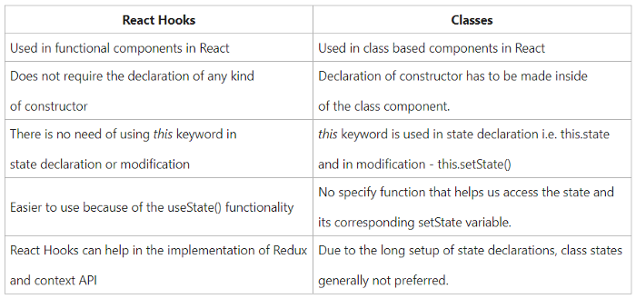

//include::_settings_reveal.adoc[]

include::_settings_deck.adoc[]

= React4teachers: 2022 edition

== React4teachers: From Zero 2 Hero

image::images/react-zero-hero.jpeg[800,600]

== Contenido del curso

* 1.- Introducció 
* 2.- De VanillaJs a React 
* 3.- React framework: Motivos de exito
* 4.- React framework: Class components vs Function components 
* 5.- React framework: State management - Control de el estado de la aplication 
* 6.- React framework: Routing 
* 7.- Storybook 
* 8.- Monorepo 
* 9.- TailwindCSS y StyledComponents 
* 10.-Despliegue de aplicaciones

== UD4 - Class components vs Function components

Aunque React presenta una logica muy estable, en algunos casos se puede complicar muchom como hemos demostrado en el ejercicio de la UD3. Algunos ejemplos son los siguientes:

- Donde guardo los datos obtenidos? Tienen vida en un solo componente? Que sucede si quiero hacer una tabla CRUD y una componente detalle? Debo cargar los elementos 2 veces?

- Como puedo controlar las propiedades que me pasan?

- Que elementos debo guardar en el estado del componente?

> Cuando estas preguntas se juntan con las diversas fases del componente, la arquitectura se vuelve compleja.

Fue en ese momento cuando se decidio publicar el concepto de React Hooks, que has utilizado en ocasiones sin conocerlo.

==  Class component

Como sabes un class component debe extender de React.Component y permite utilizar el ciclo de vida explicado en la ud anterior.
El metodo obligatorio es render()

[source,]
----
class Car extends React.Component {
  render() {
    return <h2>Hi, I am a Car!</h2>;
  }
}
----

== Class component

Las propiedades y el estado son elementos de vital importancia.
Comprueba el funcionamiento del siguiente codigo

[source,]
----
import React from "react";

class App extends React.Component {
constructor(props) {
	super(props);
	this.state = { change: true };
}
render() {
	return (
	

		<button
		onClick={() => {
			this.setState({ change: !this.state.change });
		}}
		>
		Click Here!
		</button>
		{this.state.change ? (
		<h1>Welcome to React4teachers</h1>
		) : (
		<h1>From zero to hero!</h1>
		)}
	

	);
}
}

export default App;

----

==  Function component

Un componente basado en funciones permite un codigo mas simple, y es de gran aplicacion en componentes sencillos. 

Para implementar las diferentes fases del ciclo de vida, se utilizara un concepto denominado HoC (High Order Component) a traves de los conocidos React Hooks (v16.8+).

Seran funcionalidades que se ejecutaran en el ciclo de vida correspondiente, y simplifican muchisimo el proceso de desarrollo.

[source,]
----
function Car() {
  return <h2>Hi, I am a Car!</h2>;
}
----

== Function component: state

Para aplicar los conceptos de estado y las propiedades usaremos el hook "setState" que aplica los metodos de desestructuracion y descomposicion de un array.

- la primera posicion del array sera el valor
- la segunda posicion del array sera el setter

[source,]
----
import React, { useState } from 'react';
  
const Example=()=> {
  const [change, setChange] = useState(true);     
      return (
        

        <button onClick = {() => setChange(!change)}>
          Click Here!
        </button>
        {change?<h1>Welcome to React4teachers</h1>:
                <h1>From zero to hero!</h1>}
        

        );
  }
 
export default Example;
----

== Function component: props

En el caso de las propiedades, el uso es identico en ambos. Basicamente props es un objeto que podemos referenciar de cualquier manera.

> Para estructurar las propiedades, y facilitar el uso del componente en nuestra libreria utilizaremos PropTypes

Este ejemplo es sin la utilizacion de Proptypes

[source,]
----
import React from 'react';

function App(props) {
return (
	

	<Person name="Juanito" eyeColor="blue" age="23"></Person>
	<Person name="Pepito" eyeColor="blue" ></Person>
	<Person name="Menganito" age="23"></Person>
	<Person eyeColor="green" age="23"></Person>
	

);
}

function Person(props) {
    return (
    	

    	
 Name: {props.name} 

    	
EyeColor: {props.eyeColor}

    	
Age : {props.age} 

    	

    	

    )
}
Person.defaultProps = {
    name: "Super Lopez",
    eyeColor: "deepblue",
    age: "45"
}
export default App;
----

== Hooks

Los hooks o anzuelos son funciones que devuelven un array de elementos. Cada hook, tiene una funcionalidad concreta y un caso de uso. Sin embargo, conocer los diversos hooks permite la programacion con React sin clases, y eso "simplifica" el conocimiento de la API de class. Consideraciones:

- No son un reemplazo, mas bien una alternativa
- Puedes mezclar componentes por class con functional
- No hay planes de eliminar React class
- Surgen como opcion para reutilizar logica
- Con class, los componentes pueden realmente ser complejos (ref, props, shared state..)
- Eliminamos el concepto de this y el binding
- Se ejecutan en cada actualizacion de render!

== Reglas de uso en hooks

- Solo se llaman en nivel superior. No pueden usarse en bucles, condiciones o funciones internas
- Solo se pueden usar en components React basados en funciones, o desde otros Hooks
- Su orden en el codigo es crucial

Para asegurar esas reglas se puede usar eslint-plugin-react-hooks

[source,]
----
// Your ESLint configuration
{
  "plugins": [
    // ...
    "react-hooks"
  ],
  "rules": {
    // ...
    "react-hooks/rules-of-hooks": "error", // Checks rules of Hooks
    "react-hooks/exhaustive-deps": "warn" // Checks effect dependencies
  }
}
----

https://reactjs.org/docs/hooks-rules.html[Ref]

== Diferencias hooks vs class

La mayor diferencia entre los Hooks y el estado basado en clases es que los hooks se utilizan dentro del componente funcional: no los mezcles!

Una cosa que hay que tener en cuenta es que nunca hay que llamar a los hooks dentro de una lógica, ¡siempre debe estar en el nivel superior! (HoC)

Por tanto, se usan en una funcion como si fuera equivalente al metodo render, pero en class todo esta mas organizado.

== Hooks vs class

== Hooks: Ejemplo de ejecucion

[source,]
----
function Form() {
  // 1. Definimos el estado name y valor por defecto
  const [name, setName] = useState('Mary');
  // 2. Usamos un efecto para que persista en localStorage
  useEffect(function persistForm() {
    localStorage.setItem('formData', name);
  });
  // 3. Definimos el estado apellido
  const [surname, setSurname] = useState('Poppins');
  // 4. Actualizamos el DOM
  useEffect(function updateTitle() {
    document.title = name + ' ' + surname;
  });
  // ...
}
----

Para garantizar el estado, sigue el flujo de class, de la siguiente manera:

[source,]
----
// First render
useState('Mary')           // 1. Initialize the name state variable with 'Mary'
useEffect(persistForm)     // 2. Add an effect for persisting the form
useState('Poppins')        // 3. Initialize the surname state variable with 'Poppins'
useEffect(updateTitle)     // 4. Add an effect for updating the title
// Second render
useState('Mary')           // 1. Read the name state variable (argument is ignored)
useEffect(persistForm)     // 2. Replace the effect for persisting the form
useState('Poppins')        // 3. Read the surname state variable (argument is ignored)
useEffect(updateTitle)     // 4. Replace the effect for updating the title
----

== Hooks

Si usaramos un bucle como el siguiente

[source,]
----
if (name !== '') {
    useEffect(function persistForm() {
      localStorage.setItem('formData', name);
    });
}
----

La ejecucion no puede garantizar el comportamiento entre renderizajes

[source,]
----
useState('Mary')           // 1. Leera el estado
// useEffect(persistForm)  //  Este hook no se ejecutara!
useState('Poppins')        //  2 (en lugar de 3). Fallara
useEffect(updateTitle)     //  3 (en lugar de 4). Fallara por orden de ejecucion
----

Forma adecuada:
Imagina que los hooks se guardan en un array y se garantizan por posicion.

[source,]
----
useEffect(function persistForm() {
    //  El hook se ejecuta igual, y no rompemos el ciclo ni el orden
    if (name !== '') {
      localStorage.setItem('formData', name);
}
});
----

== Hooks: useState()

useState() es un hook que permite jugar con el estado en componentes funcionales en react. Para hacer una comparación justa tomemos el mismo ejemplo del contador y veamos en qué se diferencia de la implementación anterior.

[source,]
----
import React, { useState } from 'react';
  
const ContadorHooks=()=> {
  const [count, setCount] = useState(0);     
  return (
        

        Has clickado {count} veces    
        <button onClick = {() => setCount(count++)}>
          Click Here!
        </button>
        

    );
}
 
export default ContadorHooks;
----

== Class

Veamos como seria el mismo componente con Class

[source,]
----
import React from "react";

export default class ContadorClass extends React.Component {
constructor(props) {
	super(props);
	this.state = { count: 0 };
}
render() {
	return (
	

	    Has clickado {this.state.count} veces
		<button
		onClick={() => {
			this.setState({ count: this.state.count++ });
		}}
		>
		Click Here!
		</button>
		)}
	

	);
}
}
----

== Hooks: useState

[source,]
----
const [count, setCount] = useState(0);
//que en vanillaJs equivale a
const aux = useState(0)
const otherCount = aux[0]
const setOtherCount = aux[1]
----

- Pasamos como argumento el valor inicial
- El primer elemento del array es valor del estado (getter)
- El segundo elemento del array es el setter
- Hacemos un alias comprensible
- Guardamos en const para evitar ser modificados incorrectamente, asi ejecuta la funcion interna.

Para usar los valores:

[source,]
----
// Evitamos tener que usar this:

You clicked {this.state.count} times

// Resultado

You clicked {count} times

----

== Hooks: useEffect

- Es un hook similar a componentDidMount y componentDidUpdate
- Podemos ejecutar logica fuera del scope del componente. En el ejemplo modificamos la cabecera
- Es logica que se ejecutara DESPUES de cada render

[source,]
----
import React, { useState, useEffect } from 'react';

function Example() {
  const [count, setCount] = useState(0);

  // Similar to componentDidMount and componentDidUpdate:
  useEffect(() => {
    // Update the document title using the browser API
    document.title = `You clicked ${count} times`;
  });

  return (
    

      
You clicked {count} times

      <button onClick={() => setCount(count + 1)}>
        Click me
      </button>
    

  );
}
----

Simplifica duplicacion de codigo:

[source,]
----
class Example extends React.Component {
    ...
 componentDidMount() {
    document.title = `You clicked ${this.state.count} times`;
  }
  componentDidUpdate() {
    document.title = `You clicked ${this.state.count} times`;
  }

  render() {
  ...
  }
}
----

== UseEffect

En algunos casos necesitamos especificar diferentes acciones para didMount y para willUnMount. Un ejemplo seria una aplicacion de chat, que debe cambiar el estado de conexion al resto de usuarios.

Con class seria asi:

[source,]
----
 ...
 componentDidMount() {
    ChatAPI.subscribeToFriendStatus(
      this.props.friend.id,
      this.handleStatusChange
    );
  }
  componentWillUnmount() {
    ChatAPI.unsubscribeFromFriendStatus(
      this.props.friend.id,
      this.handleStatusChange
    );
  }
  handleStatusChange(status) {
    this.setState({
      isOnline: status.isOnline
    });
  }
  ...
----

== UseEffect: return function

La solucion con useEffect es devolver una funcion, en este caso, esa funcion *se ejecutara en tiempo de limpieza o, lo que es lo mismo, en componentWillUnmount*, ofreciendo dos ejecuciones distintas.

[source,]
----
import React, { useState, useEffect } from 'react';
function FriendStatus(props) {
  const [isOnline, setIsOnline] = useState(null);
  useEffect(() => {
    function handleStatusChange(status) {
      setIsOnline(status.isOnline);
    }
    ChatAPI.subscribeToFriendStatus(props.friend.id, handleStatusChange);
    // Especificamos la ejecucion al desmontar el componente:
    //return function cleanup() {
    //  ChatAPI.unsubscribeFromFriendStatus(props.friend.id, handleStatusChange);
    //};
    // Forma habitual: arrow func
    return () => {
      ChatAPI.unsubscribeFromFriendStatus(props.friend.id, handleStatusChange);
    };
  });
  if (isOnline === null) {
    return 'Loading...';
  }
  return isOnline ? 'Online' : 'Offline';
}
----

> Puedes usar UseEffect varias veces para separar la logica de la aplicacion

== UseEffect: control de la ejecucion

> Los Effects se ejecutan en cada actualizacion

Para evitar la sobrecarga de logica en cada renderizaje, puedes usar un parametro adicional a useEffect que usara para comparar el valor de retorno. Si el valor es identico, no se ejecutara.

[source,]
----
useEffect(() => {
  document.title = `You clicked ${count} times`;
}, [count]); // Solo se ejecuta si el contador cambia
----

> Para usarlo, conviene que devuelvas en el array TODOS los valores que necesitas para comparar

> Si devuelves un array vacio, indicas que no dependes de nada, asi que se ejecutara solo una vez

== Otros hooks

Durante el curso iremos introduciendo otros hooks, como son:

- https://reactjs.org/docs/context.html[useContext], permite delegar una ambito de ejecucion de orden superior
- https://reactjs.org/docs/hooks-reference.html#usereducer[useReducer*], siendo un posible sustituto de Redux
- https://reactjs.org/docs/hooks-reference.html#usecallback[useCallback*], permite aplicar callbacks con memoria de estado
- https://reactjs.org/docs/hooks-reference.html#usememo[useMemo], para mejorar el rendimiento de funciones pesadas que queremos que se ejecuten una vez
- https://reactjs.org/docs/hooks-reference.html#useref[useRef*], para permitir referenciar partes del componente
- https://reactjs.org/docs/hooks-reference.html#useimperativehandle[userImperativeHandle] que se usa con un forwardRef.
- https://reactjs.org/docs/hooks-reference.html#uselayouteffect[useLayoutEffect], es como useEffect, pero que aplica a todo el DOM
- https://reactjs.org/docs/hooks-reference.html#usedebugvalue[useDebugValue], para utilizar con devtools

[source,]
----
function TextInputWithFocusButton() {
  const inputEl = useRef(null);
  const onButtonClick = () => {
    // `current` points to the mounted text input element
    inputEl.current.focus();
  };
  return (
    <>
      <input ref={inputEl} type="text" />
      <button onClick={onButtonClick}>Focus the input</button>
    </>
  );
}
----

== Referencias

- https://blog.bitsrc.io/6-reasons-to-use-react-hooks-instead-of-classes-7e3ee745fe04[Razones para usar hooks]
- https://medium.com/soluto-engineering/react-class-features-vs-hooks-equivalents-745368dafdb3[Equivalencias Class vs Hooks]
- https://betterprogramming.pub/react-hooks-vs-classes-add2676a32f2[Hooks vs Class]
- https://reactjs.org/docs/hooks-reference.html[Hooks reference]

== Ejercicio

En el anterior ejercicio, utilizamos a proposito React class. Tienes que conseguir migrar el codigo a react hooks y comparar el codigo resultante.

- Empieza por los componentes mas basicos
- Observa los metodos didMount
- Deja el componente general para el final
- Solo tienes que centrate en los hooks: effect y state
- Al finalizar, incorpora las acciones al menu cuando esta en modo movil

== Solucionario:Exercise2Image

[source,]
----
import React from 'react'
export default function Exercise2Image() {
    return (
        <figure className="md:flex bg-slate-100 rounded-xl p-8 md:p-0 dark:bg-slate-800">
            
            

                <blockquote>
                    

                        “Tailwind CSS is the only framework that I've seen scale
                        on large teams. It’s easy to customize, adapts to any design,
                        and the build size is tiny.”
                    

                </blockquote>
                <figcaption className="font-medium">
                    

                        Sarah Dayan
                    

                    

                        Staff Engineer, Algolia
                    

                </figcaption>
            

        </figure>
    )
}
----

== Solucionario:Exercise3Data

[source,]
----
import React, { useState, useEffect } from 'react';
const Exercise3Data=(props)=>{
    const [data, setData] = useState([]);
    useEffect(()=>{
        const fetchData = async () => {
            const response = await fetch('https://jsonplaceholder.typicode.com/users');
            const currentData = await response.json();
            setData(currentData);
        }
        fetchData();
    },[])
    return (
        

            {data.map(d=> {
                return (<figure className="bg-slate-100 rounded-xl p-8 dark:bg-slate-800" key={d.id}>
                    

                        <figcaption className="font-medium">
                            

                                {d.name}
                            

                        </figcaption>
                    

                </figure>)
            })}
        

    )
}
export default Exercise3Data;
----

== Solucionario: Header

[source,]
----
import React from "react";
export default function Header({onClick}) {
    const [menuOpen, setMenuOpen] = React.useState(false);
    return (
        <nav>
            

                

                <a className="font-bold text-2xl lg:text-4xl alternative-font" href="#">
                    React 4 teachers
                </a>
                

                    <button onClick={() => setMenuOpen(!menuOpen)}
                        className="flex items-center px-3 py-2 border rounded text-gray-500 border-gray-600 hover:text-gray-800 hover:border-teal-500 appearance-none focus:outline-none">
                        <svg className="fill-current h-3 w-3" viewBox="0 0 20 20" xmlns="http://www.w3.org/2000/svg">
                            <title>React 4 teachers</title>
                            <path d="M0 3h20v2H0V3zm0 6h20v2H0V9zm0 6h20v2H0v-2z"/>
                        </svg>
                    </button>
                

                

                

                    <ul className={(menuOpen ?"flex flex-col list-none":"inline-flex")} >
                        <li className="nav-item"><a className="px-4 font-bold" href="/">Home</a></li>
                        <li className="nav-item"><a className="px-4 hover:text-gray-800" href="#" onClick={()=>onClick(1)}>Ejercicio 1</a></li>
                        <li className="nav-item"><a className="px-4 hover:text-gray-800" href="#" onClick={()=>onClick(2)}>Ejercicio 2</a></li>
                        <li className="nav-item"><a className="px-4 hover:text-gray-800" href="#" onClick={()=>onClick(3)}>Ejercicio 3</a></li>
                    </ul>
                

            

        </nav>)
}
----

== Solucionario: App

[source,]
----
import {Hero} from "./components/Hero"
import Header from "./layout/Header"
import React, { useState } from 'react';
import Exercise2Image from "./components/Exercise2Image"
import Exercise3Data from "./components/Exercise3Data";
const App = () =>{
    const [option, setOption] = useState(1);
    const setActiveOption = (val) => {
        console.log(`Callback - changing state value to ${val}`)
        setOption(val);
    }
    let renderingPart = "";
    switch (option){
        case 1:
            renderingPart = <Hero/>
            break;
        case 2:
            renderingPart = <Exercise2Image/>
            break;
        case 3:
            renderingPart = <Exercise3Data/>
            break;
        default:
            break;
    }
    console.log(`Current state value is ${option}`)
    return (<body className="text-gray-700 bg-white">
    <Header onClick={setActiveOption}/>
    {renderingPart}
    </body>)
}
export default App;
----

