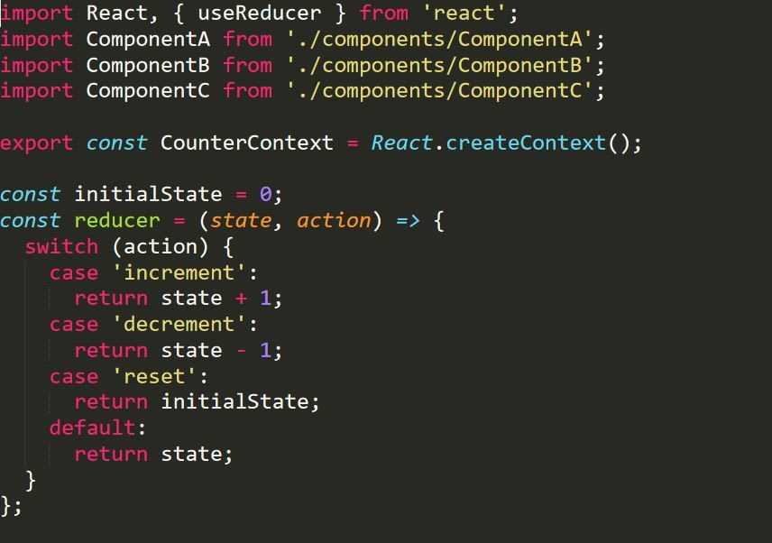
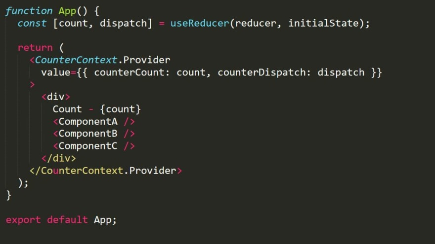
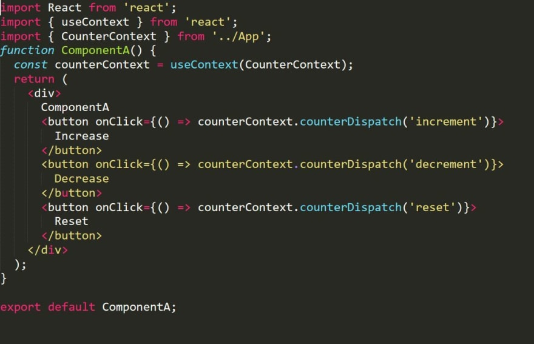

//include::_settings_reveal.adoc[]

include::_settings_deck.adoc[]

= React4teachers: 2022 edition

== React4teachers: From Zero 2 Hero

image::images/react-zero-hero.jpeg[800,600]

== Contenido del curso

* 1.- Introducció 
* 2.- De VanillaJs a React 
* 3.- React framework: Motivos de exito
* 4.- React framework: Class components vs Function components 
* 5.- React framework: State management - Control de el estado de la aplication 
* 6.- React framework: Routing 
* 7.- Storybook 
* 8.- Monorepo 
* 9.- TailwindCSS y StyledComponents 
* 10.-Despliegue de aplicaciones

== Ch5 - State management

Hasta ahora hemos visto el estado de los componentes bajo class y hook useState, lo cual nos permite guardar el comportamiento de un componente de forma independiente.

Este concepto es VITAL para los componentes...pero...

- Que sucede si quiero mantener el mismo estado en diversos componentes? Por ejemplo, mantener la opcion marcada, usarla para destacar el menu, y a la vez, mostrar un mensaje en el footer.
- Si quiero mostrar una pagina master/detail con los detalles de los diversos usuarios (otro componente), tengo que cargar todos los datos de la api otra vez?

> Este concepto, de gran complejidad, se denomina ESTADO DE LA APLICACION

== State management

Todos los admiministradores de estados de aplicacion usan el mismo concepto, similar a BBDD k-V, como Redis, Hazelcast o memcached:

- K: Utilizan una clave unica para almacenar logica. 
- V: El valor puede ser una funcion CRUD o un conjunto de datos, normalmente json

> La implementacion de React Hooks, incorpora el hook reducer, que puede dar solucion en muchos casos.

Estos conceptos utilizan la siguiente nomenclatura:

- modelo, store, provider: es el conjunto de acciones + persistencia deseada
- key, atom, action: es la funcionalidad a ejecutar
- state: el estado de la aplicacion, que ahora pasa a ser interno del framework

== State management

El estado de la aplicacion es un concepto que no es nativo en ningun framework y sus aproximaciones suponen una complejidad anadida al desarrollo (p.e., usando localStorage y controlando sus accesos y modificaciones), pero todo ese entorno, esta repetido en todas las aplicaciones.

Por ello, para "evitar" rehacer el mismo trabajo siempre se utilizan librerias denominadas StateManagers, como son (en React):

- Recoil
- Redux: Reducers
- Rematch
- MobX
- Saga: function generators

== Consejos sobre state manager

- Apuesta por un state manager solido
- Versatil
- Reutilizable en proyectos a traves de monorepo
- De impacto en la comunidad

Una mala eleccion, implica refactorizacion.

Cual usaremos nosotros?

- Veremos una aproximacion a reducer a traves del hook useReducer y useContext
- Utilizaremos la implementacion de redux a traves de modelos de Rematch*
- Veremos como se convierte esa implementacion con react-redux y reducers, que es la opcion mas "fiable"

== Aproximacion a useContext

- Cuando useState no es suficiente notaras que pasaras a utilizar props en un nodo padre
- El padre pasara el contenido de los estados por propiedad a los hijos
- La aplicacion se volvera sumamente compleja: ref, props (proptypes), state y bindings o callbacks para manejar el estado.
- El siguiente nivel de simplificacion es el hook useReducer
- Para usarlo, realizaremos lo siguiente:

1. Generaremos un contexto
2. Englobaremos el componente bajo el contexto
3. Dentro del componente, usaremos el contexto.

== useContext

[source,]
----
// Paso 1: Generamos el contexto de aplicacion
// Fuera decomponentes -> lo debemos exportar
export const MyDataContext = React.createContext();

// Paso 2: Envolvemos el componente con el contexto
function TheComponentWithState() {
  const [state, setState] = useState('whatever');
  return (
    <MyDataContext.Provider value={state}>
      <ComponentThatNeedsData/>
    </MyDataContext.Provider>
  )
}

// Paso 3: En el componente accedemos al contexto
function ComponentThatNeedsData() {
  const data = useContext(MyDataContext);
  // lo usamos
}
----

== Aproximacion a useReducer

[source,]
----
import React, { useReducer } from 'react';
const initialState = {
  count: 0
};
function reducer(state, action) {
  switch (action.type) {
    case 'increment':
      return {count: state.count + 1};
    case 'decrement':
      return {count: state.count - 1};
    default:
      return initialState;
  }
}
function Counter() {
  const [state, dispatch] = useReducer(reducer, initialState);
  const handleInc= () => dispatch({type: 'increment'});
  const handleDec= () => dispatch({type: 'decrement'});
return (
    <>
      Count: {state.count}
      <button onClick={handleDec}>-</button>
      <button onClick={handleInc}>+</button>
    </>
  );
}
----

https://medium.com/suyeonme/using-usecontext-and-usereducer-together-lets-create-redux-like-global-state-in-react-87470e3ce7fa[Ref]

== Hooks State management: app.js

- Generamos un contexto y un reductor, que por ahora pondremos en la cabecera de la aplicacion

== Hooks State management: app.js

- Utilizamos el reductor, que devolver el estado deseado y una funcion dispatch
- Envolvemos el componente interno, ya no necesitamos usar un callback

== Hooks State management: menu.js

- El componente hijo utiliza useContext para acceder al contexto en el que hemos englobado antes. Asi accede al "store"
- A traves de dispatch, llama a la accion con un string (k)

== Ejercicio 1

Aplica los reductores con useReducer y useContext a las acciones del menu.

== Solucion al ejercicio

== State management

- Recoil
- Redux: Reducers
- Rematch
- MobX
- Saga: function generators

== Recoil overview

- Compatible con hooks y class
- Utiliza el concepto de atom y selectores
- Bajo impacto sobre hooks useState a useRecoilState

[source,]
----
import React from 'react';
import {
  RecoilRoot,
  atom,
  selector,
  useRecoilState,
  useRecoilValue,
} from 'recoil';

function App() {
  return (
    <RecoilRoot>
      <CharacterCounter />
    </RecoilRoot>
  );
}
const textState = atom({
  key: 'textState', // unique ID (with respect to other atoms/selectors)
  default: '', // default value (aka initial value)
});
----

== Recoil

Beneficios:

- Simple, similar a sintaxis de React
- Usado por facebook en herramientas internas
- Rendimiento

Inconvenientes:

- Demasiado nueva

== Redux overview

- Muy utilizado
- Compatible con class y hooks
- Logica de aplicacion separada
- Requiere preparacion
- Reutilizable en diversos proyectos (base vanilla)

[source,]
----
// Usamos una funcion de reduccion que controla estados
// Esta funcion se llama con una accion
function counterReducer(state = initialState, action) {
  // Segun la accion que se ejecute, modificamos 
  // la logica y devolvemos el state
  switch (action.type) {
    case 'counter/incremented':
      return { ...state, value: state.value + 1 }
    case 'counter/decremented':
      return { ...state, value: state.value - 1 }
    default:
      // Si no hay cambios, devolvemos el mismo estado
      // (acciones incorrectas?)
      return state
  }
}
----

== Redux 

Beneficios:

- Usado desde 2015
- Soporte en herramientas de desarrollo
- Permite ver el historico de cambios de estado
- Pequeno: redux + react-redux = 3kb
- Muy funcional
- El ecosistema sincroniza localStorage y callbacks

Problemas:

- Cuesta un bloqueo mental
- Requiere definir cada aspecto, por lo que su implementacion no es muy rapida.

== Rematch overview

- Se utiliza con redux para simplificar su implementacion
- Utiliza el mismo concepto de Store
- Incorpora models para evitar los reducers

[source,]
----
import React from 'react'
import ReactDOM from 'react-dom'
import { Provider } from 'react-redux'
import { init } from '@rematch/core'
import createUpdatedPlugin from '@rematch/updated'

import * as models from './models'
import App from './App'

const store = init({
	models,
	// create plugin
	plugins: [createUpdatedPlugin()], // add to plugin list
})

ReactDOM.render(
	<React.StrictMode>
		<Provider store={store}>
			<App />
		</Provider>
	</React.StrictMode>,
	document.getElementById('root')
)
----

- https://rematchjs.org/[Rematch website]
- https://github.com/rematch/rematch/blob/main/examples/updated-react[Rematch example]

== MobX overview

[source,]
----
import {observer} from 'mobx-react-lite'
import {createContext, useContext} from "react"

const TimerContext = createContext<Timer>()

const TimerView = observer(() => {
    // Grab the timer from the context.
    const timer = useContext(TimerContext) // See the Timer definition above.
    return (
        Seconds passed: {timer.secondsPassed}
    )
})

ReactDOM.render(
    <TimerContext.Provider value={new Timer()}>
        <TimerView />
    </TimerContext.Provider>,
    document.body
)
----

== Mobx

Beneficios:

- Es reactivo, si se modifica un valor, renderiza todos los componentes que lo usan
- No hay acciones ni reductores
- Menos codigo

Problemas:

- No tan usado como redux
- Menos codigo > magia!
- Requiere proxies ES6, por lo que no es compatible con ECMA5 (IE11)

== Saga overview

Utiliza  el concepto de function generators de vanillaJs
Su uso es altamente complejo

[source,]
----
import { takeEvery } from 'redux-saga/effects'
import Api from './path/to/api'

function* watchFetchProducts() {
  yield takeEvery('PRODUCTS_REQUESTED', fetchProducts)
}
function* fetchProducts() {
  const products = yield Api.fetch('/products')
  console.log(products)
}
----

https://redux-saga.js.org/docs/basics/DeclarativeEffects[Saga]

== Referencias

https://www.burhanuday.com/blog/react-context-api-usereducer-redux-ogo[React context api + reducer = redux]
